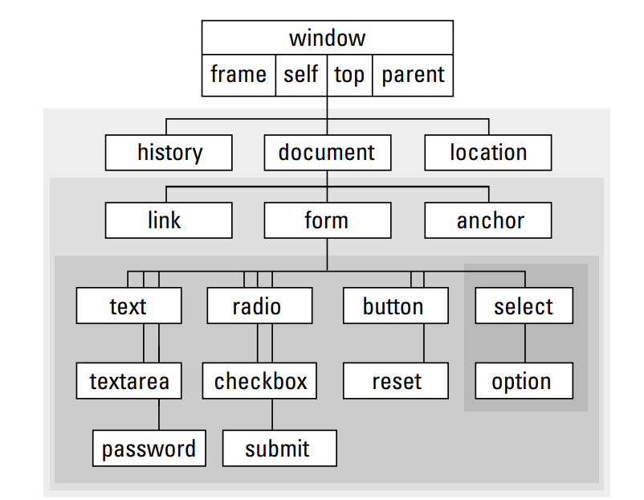

### JavaScript Notes

### Script Interacting with Navigator Object (User's Browser Info)

``` javascript
<html>
    <head>
        <title> What's Your Broswer Version?</title>
    </head>

<body>
    <script>
    <!-- below this scripts are rendered
        document.write("Your browser is version" + navigator.appVersion + "<br>")
        document.write("and browser is <B>" + navigator.appName + "</B>"
        + "also known as" + navigator.appCodeName)
        document.write("I see you! You're at " + navigator.geolocation)    
    // end of script hiding>    
    </script>
</body>

</html>
```

here the `<B>` is the HTML boldface element, and `navigator` is the broswer object in Javascript, which has several interesting attributes ( TODO: link here)

Scripts written after comment lines are rendered on all browsers that are not ancient, hence the "end of script hiding" line

### Document Object Model 

Controls the madness of adding dozens of separate objects to a page. The model servers as a prototype for the rendering of the page. 

While different browsers support different types of DOMs, there is a baseline model that will word on even the oldest browsers. There exists an idealized hierarchy: 



`object references` help you identify the object and extract information on the object (such as what the user types into the text box). Object indentifiers:
- must not contain spaces
- no punctuation
- need be inside quotes
- no beginning with numeric characters

ID's are more common identifiers, and work well with CSS

### Retrieving Object properties

- note about text input: while the default value of a form field in the written HTML could be that HTML-designated value, once the user inputs a new value, the DOM stored by the browser's memory changes to store the iputted user value. 
- 
- To gain access to any property, use the DOM hierarchyy model, the name of the object, and the name of the property. For example

``` javascript
document.formname.clicker.clickername
document.formname.entry.value
```
we can omit the window portion since there can only be one window per document. `document` cannot be ommited. 

Notice that writing out the full hierarchichal name of the object is good practice, but with modern browsers we can just refer to an element by its specified `id`. 

### Event Handlers in JS

In Javascript, objects have properties, methods, and event handlers. 

An example of such an event handler is :

```javascript
<html>
    <head></head>
    <body>
        <form>
            <INPUT TYPE = "button" VALUE = "Click here!"
            onClick = "window.alert('Thanks for clicking...')">
        </form>
    </body>
</html>
````

TODO: why is everything capitalized? for properties i mean. 

This is so cool!!!!!


### Embedding Scripts

- in modern browsers, we don't use the `language` tag to specify JS. You can always use the `TYPE` tag but it's not necessary. 

`TYPE = text/javascript`

- even better practice is to embed the javascript using the SRC sttributed TODO: demonstrate. 

```javascript
<script  src="jsFile.js">
</script>
```

#### Where to place the script?

For content that is 